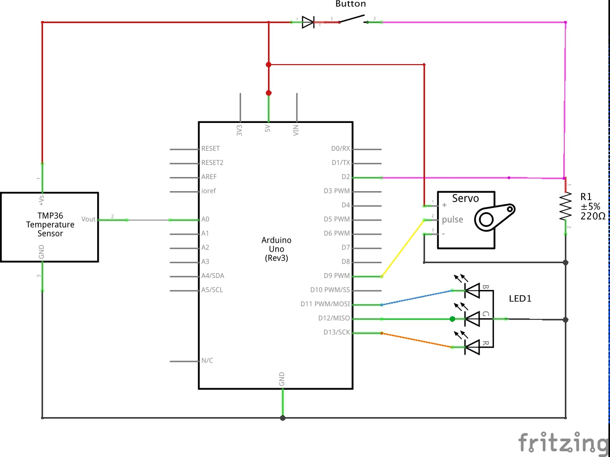
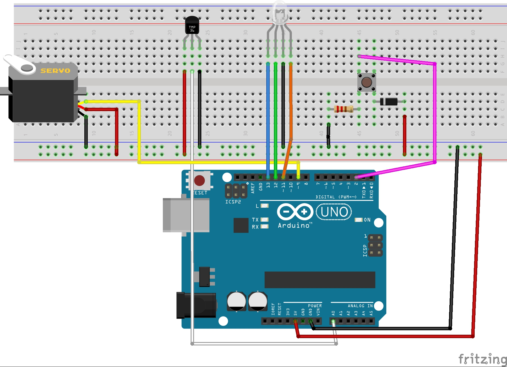
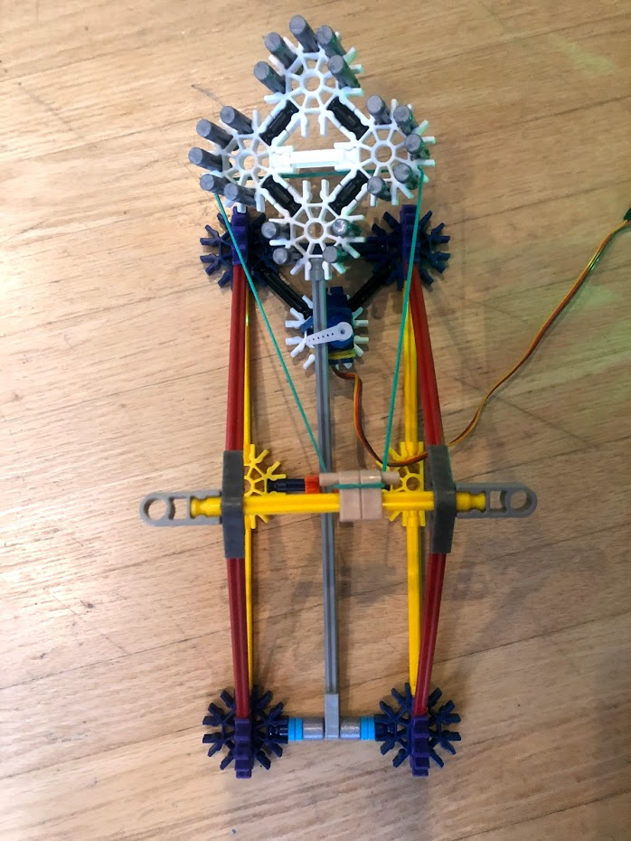
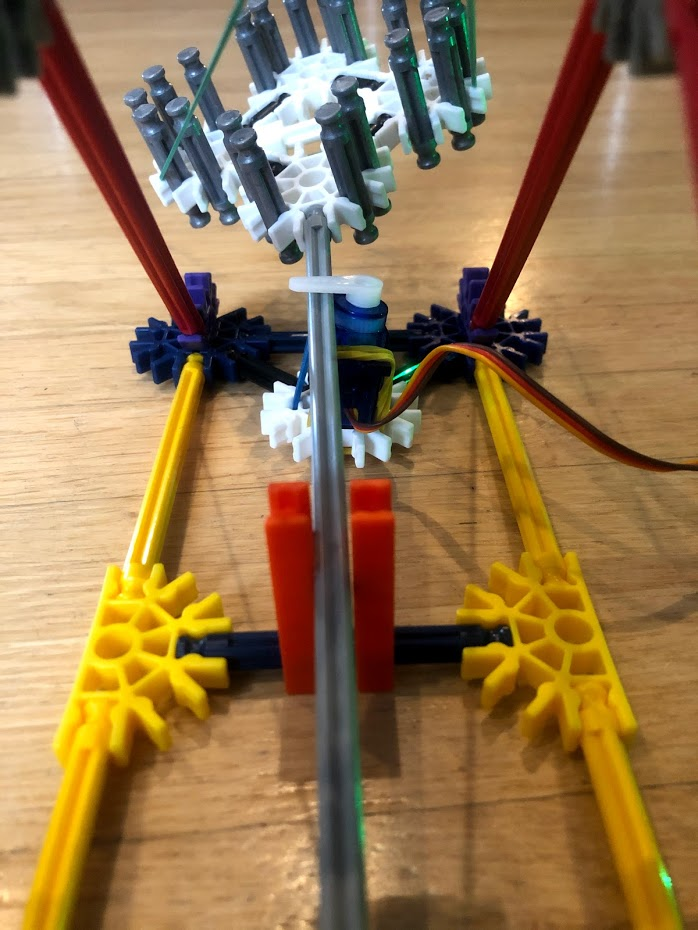
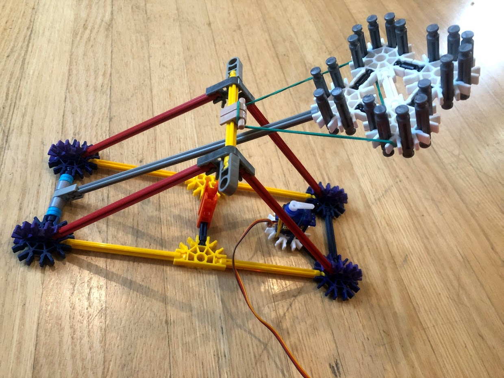
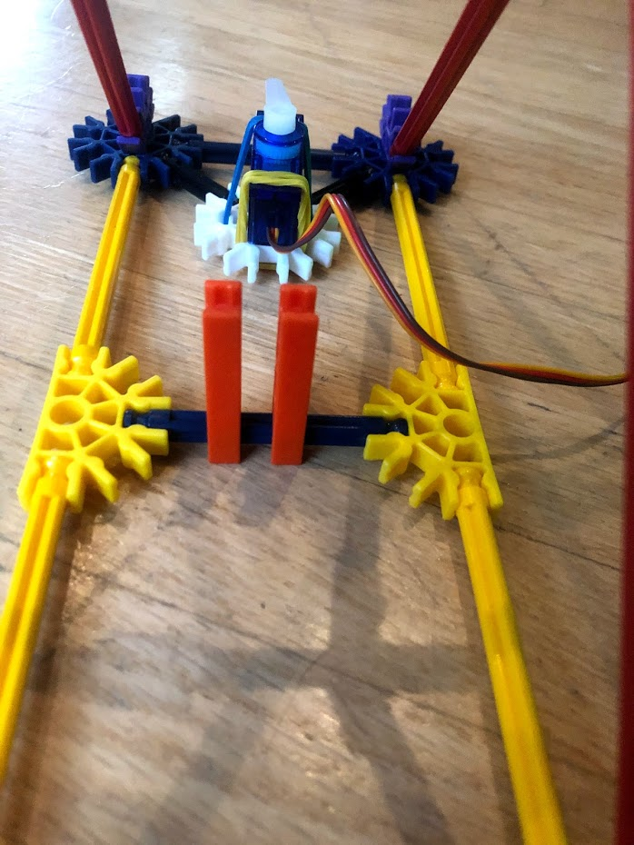

# CS-207-Project

## Project Overview
This project is a temperature sensor catapult. If the temperature sensor reads above a certain temperature a catapult will launch to alert everyone. 
As well as having a catapult launch there is also a colour changing LED in the circuit. This LED starts at blue and as the temperature rises it turns to green to give a warning that the catapult might launch soon. When the catapult does launch the LED will turn red. 

## Materials 
- Servo motor 
- RGB LED 
- Temperature sensor
- Push button 
- Diode
- Resister (I used a 10,000 ohm one)
- Wires for connections (17 in total)
- K'nex or some other building materials for the catapult. I used an elastic for the tension to make it launch. 

## Set Up 

This project is written for an Arduino Uno. Download the Project.ino code and set up breadboard as in diagram below.
In my build I used a 10,000 ohm resistor for the button but Fritzing did not have one available for my diagrams. 

The code has two thresholds. The first one is to turn the LED from blue to green. The second one (which is set higher) is to change the LED to red and launch the catapult. Note readings from the temperature sensor are converted to Celsius and not Fahrenheit. 
  The threshold to change the LED from blue to green is an integer called blue2green. 
  The threshold to change the LED from green to red as well as release the catapult is an integer called green2launch. 
Change these thresholds as you need and change from an integer to a float if you want a threshold that has a decimal. 

As well, there is a stability variable that you may want to change. The stability variable exists so that if the temperature is hovering right around a threshold the LED does not rapidly change colours as the temperature bounces just above and just below the threshold. When the temperature is increasing it must be above the threshold. However, when the temperature is decreasing it must be below the threshold minus the stability variable. For example if the lower threshold was set to 20 degrees and the stability variable is set to 0.2, then the LED will change from blue to green at 20 degrees and will change from green to blue at 20 - 0.2 = 19.8 degrees. Note that the stability variable should be a positive value that is smaller than the difference between the two thresholds. 

## Schematic and Breadboard Diagrams 

## Photos of Built Project 

This is what the project looks like when the catapult it loaded and waiting to launch. Note the servo arm holding the catapult down. 

This is a better view of the servo arm when the catapult is loaded. Also, note the orange blocks that keep the catapult arm from aligned underneath the servo arm. Without these blocks the grey catapult arm can swing out from underneath the servo arm. 

This is what the catapult looks like after it has been released. Notice the servo arm has now moved. 

