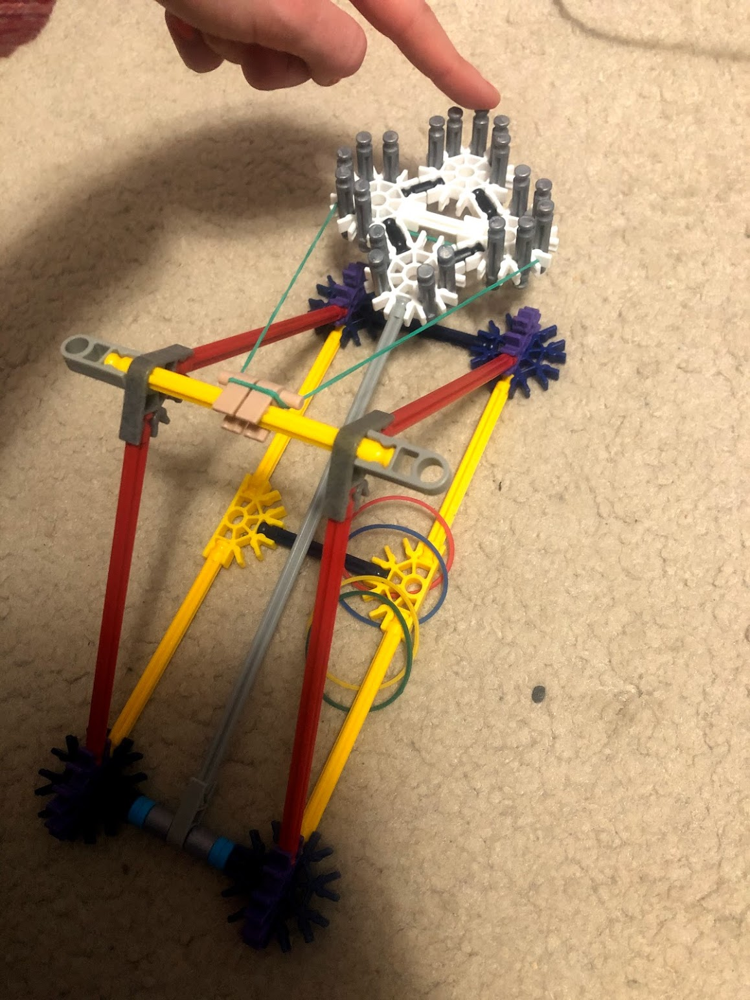
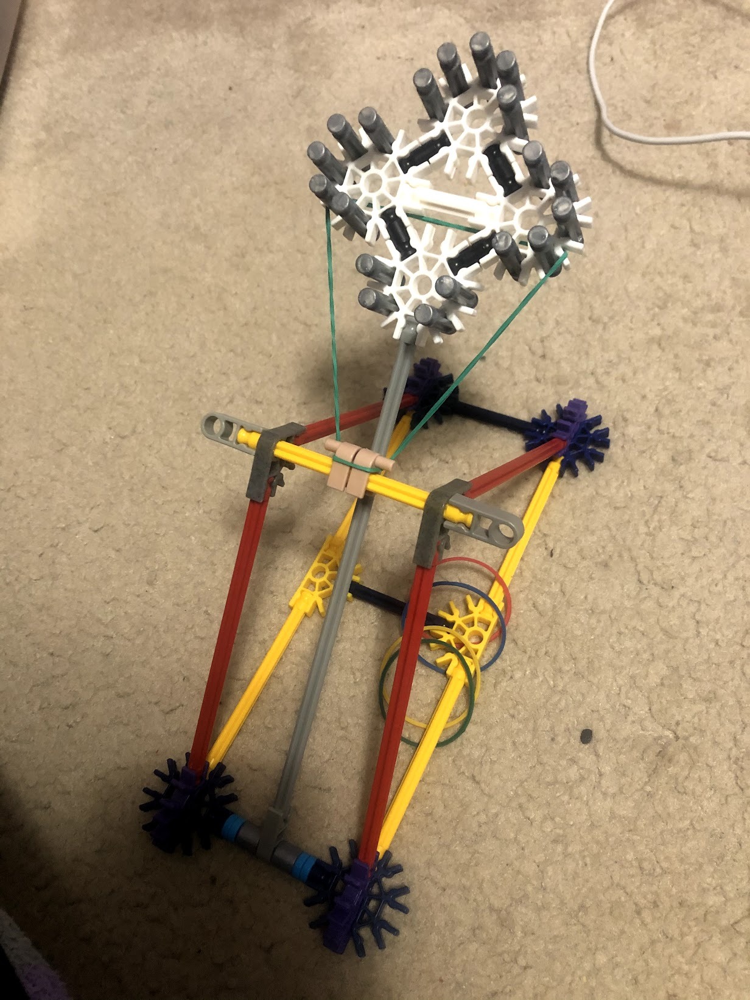

# CS-207-Project

## Project Overview
This project is a temperature sensor catapult. If the temperature sensor reads above a certain temperature a catapult will launch to alert everyone. 
As well as having a catapult launch there is also a colour changing LED in the circuit. This LED starts at blue and as the temperature rises it turns to green to give a warning that the catapult might launch soon. When the catapult does launch the LED will turn red. 

## Materials 
- Servo motor 
- RGB LED 
- Temperature sensor
- Push button 
- Resister (I used a 10,000 ohm one)
- Wires for connections (17 in total)
- K'nex or some other building materials for the catapult

## Set Up 

This project is written for an Arduino Uno. Download the Project.ino code and set up breadboard as in diagram below.

1

